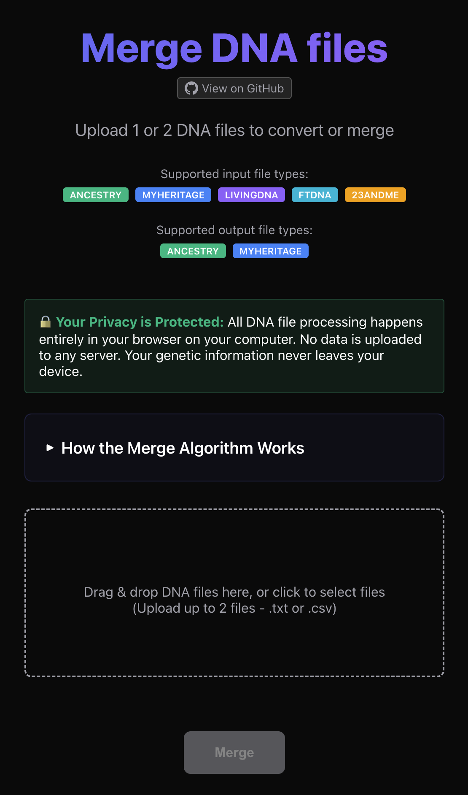
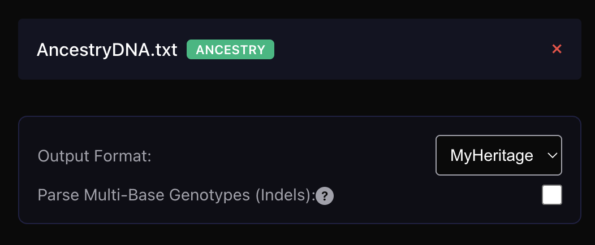
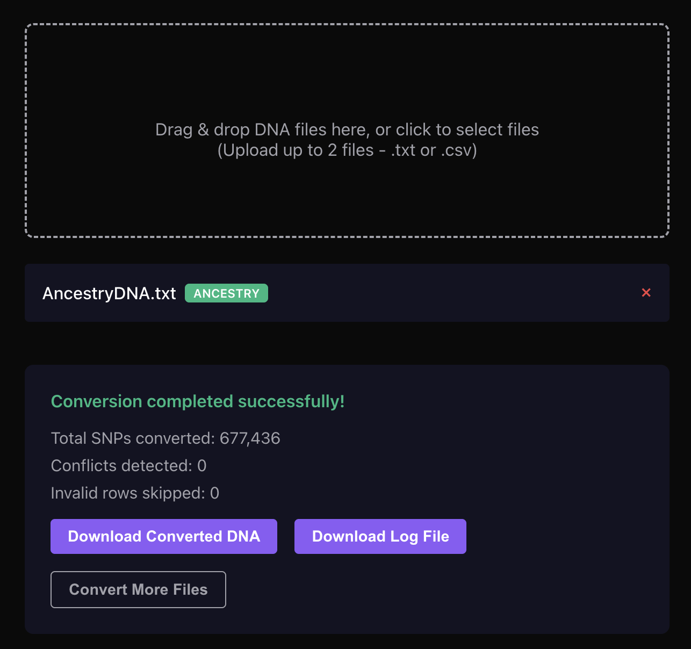
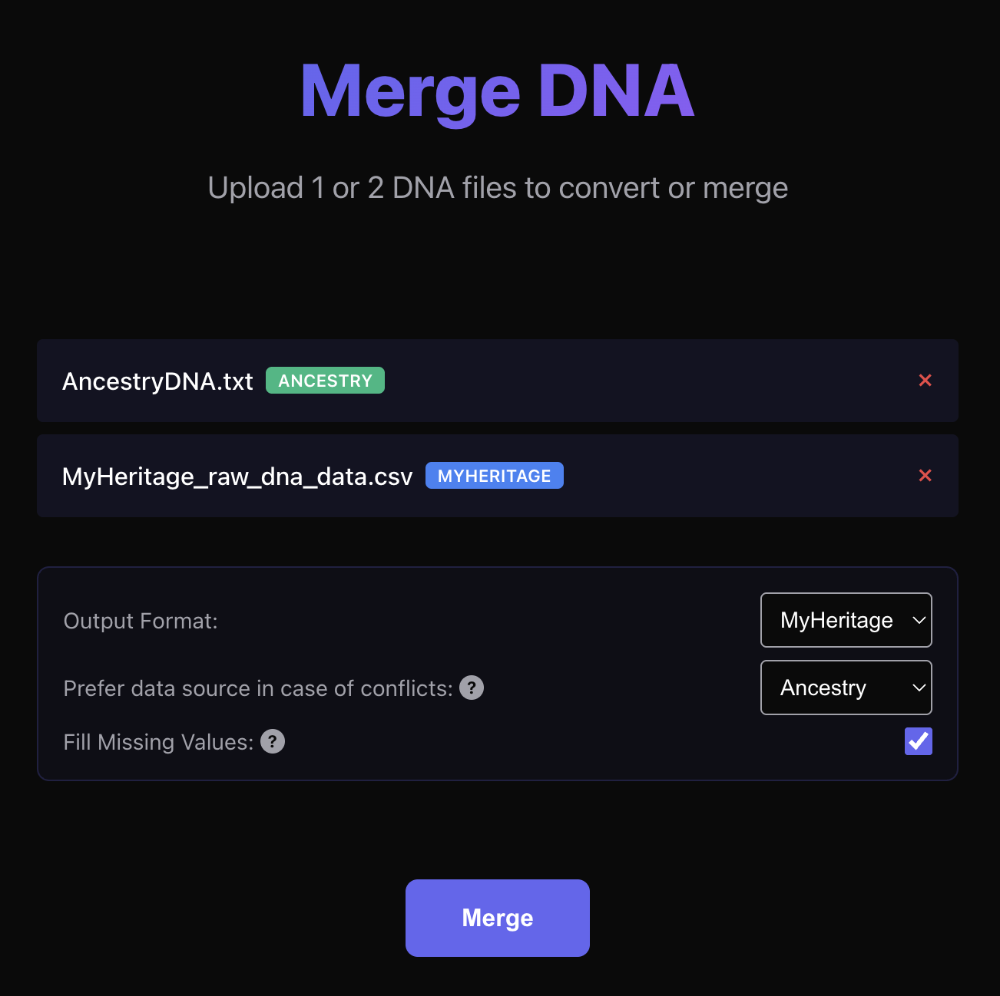
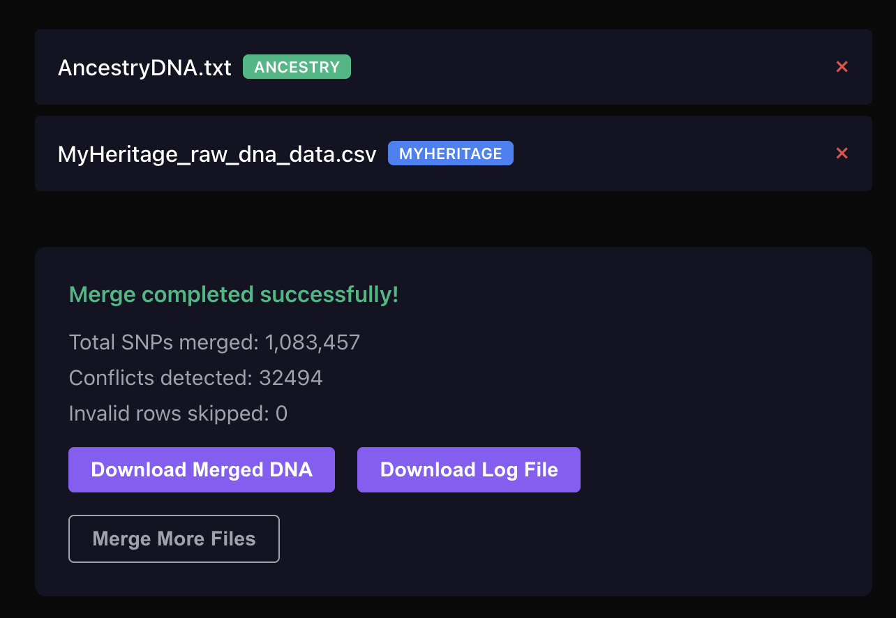

# Merge DNA files

A web-based tool for merging and converting DNA test files from consumer genealogy testing services. Process your raw genetic data from multiple DNA tests in one place with intelligent conflict resolution and detailed logging.

## What Does This Do?

If you've taken DNA tests from different companies (like AncestryDNA, MyHeritage, 23andMe, etc.), you may want to:

- **Merge** data from two different tests into a single, comprehensive file
- **Convert** DNA files between different formats for compatibility with various analysis tools
- **Resolve conflicts** when the same genetic marker shows different results across tests
- **Fill gaps** by combining complete data from one test with incomplete data from another

All processing happens **entirely in your browser** - your genetic data never leaves your computer.



## Supported Formats

The tool works with two common DNA file formats:

### Ancestry Format (.txt)
Tab-separated text files typically from AncestryDNA tests, containing:
- SNP identifier (rsid)
- Chromosome number (1-22, X, Y, MT)
- Position
- Two separate alleles (e.g., A, T, C, G)

### MyHeritage Format (.csv)
Comma-separated CSV files from MyHeritage tests, containing:
- SNP identifier (RSID)
- Chromosome (1-22, X, Y, MT)
- Position
- Combined genotype result (e.g., "AT", "GG")

## How It Works

### Single File Mode: Convert Between Formats

Upload one DNA file and the tool will:

1. **Auto-detect** the source format (Ancestry or MyHeritage)
2. **Convert** to the opposite format
3. **Normalize** genotypes according to format conventions
4. **Download** the converted file

This is useful when you need your DNA data in a specific format for analysis tools or uploading to different genealogy services.



After conversion completes, you'll see the results:



### Two File Mode: Merge Tests

Upload two DNA files and the tool will:

1. **Parse** both files and validate the data
2. **Combine** all unique genetic markers from both tests
3. **Detect conflicts** where the same marker has different results
4. **Resolve conflicts** using your preferred strategy:
   - **Fill missing values**: Use data from one test to fill gaps in the other
   - **Prefer specific source**: Choose which test to trust for conflicts
5. **Generate** a merged file and a detailed log



After merging completes, you'll see detailed results:



### Intelligent Conflict Resolution

When the same genetic marker (SNP) appears in both files with different results, the tool uses a smart resolution strategy:

**Priority 1: Fill Missing Data**
If one test shows a missing value (-- or 00) and the other has actual data, use the real data.

**Priority 2: Preferred Source**
For genuine conflicts where both tests have values, use the data from your designated preferred source.

All conflict resolutions are logged with explanations.

### What You Get

After processing, you'll download:

1. **Merged/Converted DNA file** - In your chosen format (Ancestry or MyHeritage)
2. **Log file** - A detailed report containing:
   - Summary statistics (total SNPs, conflicts, skipped rows)
   - Conflict details showing original values and resolution reasons
   - List of any invalid data that was skipped with explanations

Files are timestamped and named descriptively so you can track different merge strategies.

## Key Features

- **Automatic format detection** - Just upload your files
- **Intelligent validation** - Ensures data integrity by checking chromosome values, genotypes, and format compliance
- **Conflict transparency** - See exactly what conflicts occurred and how they were resolved
- **Flexible output** - Choose your preferred output format regardless of input formats
- **Privacy-first** - All processing happens client-side in your browser
- **Comprehensive logging** - Detailed reports for every merge operation
- **Data quality metrics** - See how many SNPs were merged, conflicts found, and rows skipped

## Use Cases

**Genealogists** - Combine DNA tests from multiple services to get the most complete genetic profile for genealogy research.

**Data Analysis** - Convert DNA files to the format required by specific analysis tools or upload services.

**Quality Improvement** - Use data from a more complete test to fill gaps in an older or less comprehensive test.

**Format Compatibility** - Convert between formats when uploading to different DNA analysis platforms.

**Data Verification** - Compare results from two different tests and see where they agree or conflict.

## Getting Started

### For Users

1. Open the application in your browser
2. Drag and drop your DNA file(s) or click to browse
3. If uploading two files, configure your merge preferences:
   - Choose output format (Ancestry or MyHeritage)
   - Select preferred source for conflicts
   - Enable/disable filling missing values
4. Click "Merge Files" or let conversion happen automatically
5. Download your merged/converted file and log

### For Developers

**Development:**
```bash
npm install
npm run dev
```

**Build for production:**
```bash
npm run build
npm run preview
```

**Run tests:**
```bash
npm test
```

**Code quality:**
```bash
npm run lint
npm run format
```

## Technical Implementation

This is a modern React application built with TypeScript and Vite. Key technical aspects:

- **Client-side processing** for privacy
- **Format-aware parsing** with separate handlers for each DNA file format
- **Validation framework** that checks chromosome values, genotypes, and data integrity
- **Smart sorting** by chromosome and position
- **Conflict resolution algorithm** with configurable priorities
- **Comprehensive error handling** with detailed reporting

For more details about the tech stack, see `package.json`.

## Contributing

Contributions are welcome! Whether it's bug reports, feature requests, or code contributions, please feel free to open an issue or pull request.

## License

MIT

## Privacy Note

Your genetic data is sensitive and personal. This application processes everything locally in your browser - files are never uploaded to any server. For maximum privacy, you can even run this tool offline after initial load.
